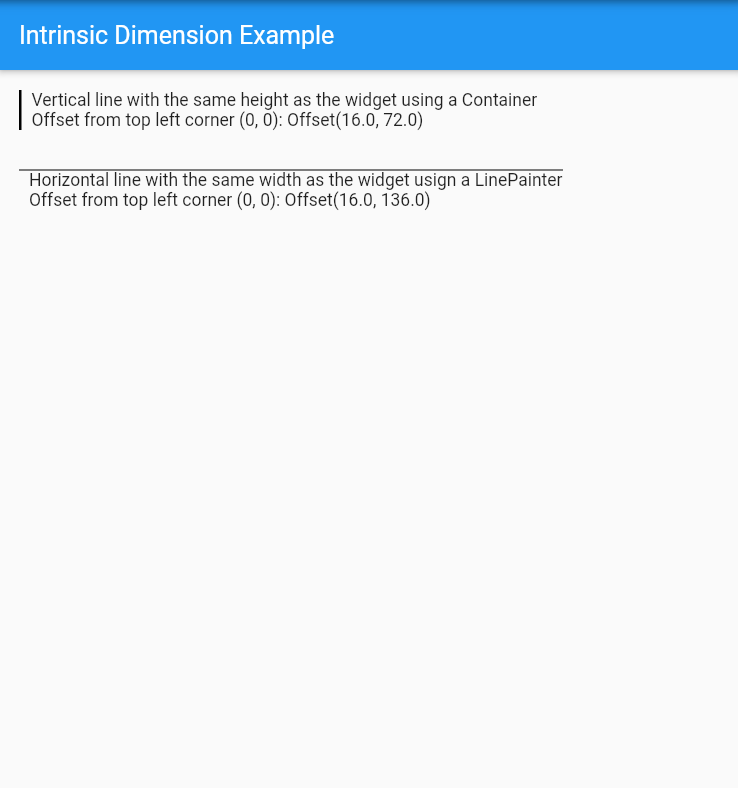

<p align="center">
  
</p>

# <div align="center">IntrinsicDimension</div>

<div align="center">A widget that expose a builder to obtain the dimensions of the widget returned from the builder.</div>

## Motivation

There are some situations when we want to know the dimensions of a widget to make an operation or to create another widget based on those dimensions. However, we cannot know the dimensions of a widget because the widget could not have an specific dimension.

For example, imagine you have a `Text` widget and you want to know the height of the widget to draw a vertical line of the same height. How can we know the height of the widget if we don't know the `fontSize` and the interline space?

In this case, we need to draw the widget and then, from the first frame, get the render box of the widget which contains the dimensions to be able to operate with those dimensions on the next frames.

## Usage

Return the widget you want to know its dimensions from the `builder` function of the `IntrinsicDimension` widget.

### main.dart

```dart
void main() => runApp(MyApp());

class MyApp extends StatelessWidget {
  @override
  Widget build(BuildContext context) {
    return MaterialApp(
            title: 'Intrinsic Dimension Example',
            debugShowCheckedModeBanner: false,
            home: Scaffold(
                appBar: AppBar(
                title: const Text('Intrinsic Dimension Example'),
                ),
                body: IntrinsicDimension(
                    builder: (context, width, height, startOffset) {
                        // use the height to draw the vertical line
                        // in the second frame
                        return Row(
                                children: [
                                Container(
                                    width: 2,
                                    height: height,
                                    color: Colors.black,
                                ),
                                const SizedBox(width: 8),
                                Column(
                                    crossAxisAlignment: CrossAxisAlignment.start,
                                    mainAxisSize: MainAxisSize.min,
                                    children: [
                                        const Text('Vertical line'),
                                        Text('Offset: $startOffset'),
                                    ],
                                ),
                            ],
                        );
                    },
                ),
            ),
        );
    }
}
```

## Gallery



## Dart Versions

- Dart 2: >= 2.12

## Author

- [Abel Rodríguez](https://github.com/Abel1027)
